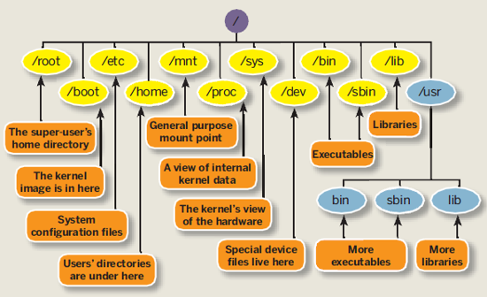

## Practica 1. Interprete de comandos.

### Resumen

Se practica la interacción con el sistema operativo mediante el interprete de comandos.

### Desarrollo

- Shell Bash
- stdin, stdout, stderr
- vim
- gcc
- JDK
- Python
- Bash scripting
- Git y GitHub
- Markdown

### Resultados

Resultados...

### Discusión

### Conclusiones

Conclusiones...

:rocket:
